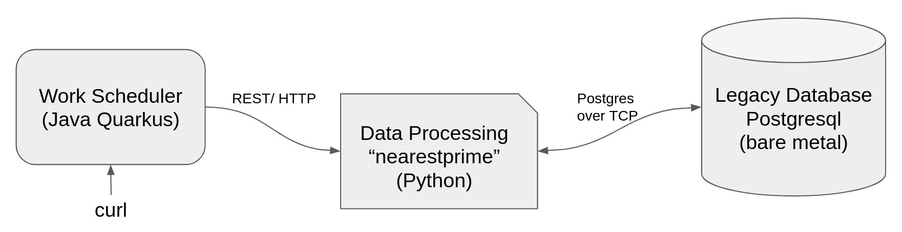

# Application Interconnect Multi-Site Load Balancing Demonstration

## Overview
This project demonstrates how Red Hat Application Interconnect (RHAI) can be used to integrate databases and client applications with globally distributed services. The demonstration highlights some important characteristics of RHAI such as:
1. Integration of VM or bare metal-hosted databases with Kubernetes-based applications.
2. Simplified multi-site application integration.
3. Geolocation hosting flexibility
4. Global cost-based routing

**Note:** Red Hat Application Interconnect is based on the updstream opensource project `Skupper`.

The project deploys a database on to a bare metal serer (your laptop), and a front end that is globally distributed across two OpenShift clusters. The final component is a work scheduler/load generator that you will run manually on your laptop. (Note: You could easily extend this to use a second VM.) The load generator is controlled via `curl` requests. 

The load generator requests the front end to calculate a nearest prime number to the number that is supplied. The front end then updates the on-premises database with the result. Prime numbers were chosen because the calculation can vary from very fast to being very computationally intensive. This introduces some randomness in the front-end's response time and thus demonstrates some important load balancing features of RHAI.

REVISIT: Update diagram

## Table of Contents
[Overview of this project](./docs/overview.md)

[Database Setup](./docs/database-setup.md)

[Demo script](./docs/demo-script.md)

