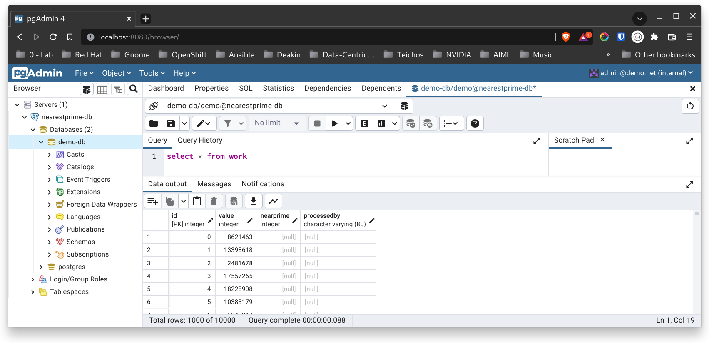

# One-Time Environment Setup
Before you run this demonstration you need to install ```pgsql.```  

**TODO:** Remove the need to install pgsql and launch ```pgadmin4``` in a container.

On Fedora:
```
sudo dnf install -y postgresql
```

# Database Setup

The first set of steps are performed before you start the demonstration.

## Start the "on-prem database" and pre-load the data

The database initialisation scripts are all located in `tools/dbsetup/python`. 

```
cd tools/dbsetup/python
```

## Runing in a shared Python environment
If you do not want to work in a pythyon virtual environment enter the following command into a shell:
```
./setup-pgsql.sh
```

## Running in an virtual Python environment

If you are using Python virtual environments, first create the virtual environment (you only ever need to do this once):
``` 
mkvirtualenv nearest-prime
```

Start the database using: 
```
./start-np.sh
```

The output from the setup scripts provides all of the database connection details:
```
python$ ./start-np.sh 
Checking for container runtime...
Podman is installed
Installing required python libraries...
Requirement already satisfied: psycopg2-binary in /home/bryon/Envs/nearest-prime/lib64/python3.10/site-packages (2.9.3)
Starting postgresql database
2a6c52e2943324446ab88e5e2d9364a833e9d98f76eab6dbace425ec0e4e98ae
Starting pgadmin4
4bad6f92d7da96a32025501081d516a8bd04f75e36e9b6aa3d525a3605825fb4
Waiting for the database to start
.Initialising database

Postgresql Admin Console access details:
========================================
Pgadmin URL: http://localhost:8089
DB Admin email:  admin@demo.net
DB Admin password: password

Database connection details:
============================
Database server url is:  rh-brbaker-bakerapps-net
Database connection port: 5432
Database database:  demo-db
Database user:  demo
Database password:  demopass
To test the database has been initialised run the following query in pgadmin4:
select * from work

```

### Verify the setup
The first time you run the demo you may want to double check your database running in the conatiner can be accessed. You can verify the database setup using `pgadmin4`. You open the Postgresql admin consol at the url and login using the DB Admin credentials displayed above.

Add a new database using the Database Connection Details displayted above, and run the query `select * from work`.

The query result should be a list of prime numbers.



# Configure Local Hostname Resulution
On the same machine that is running the database and load generator, update /etc/hosts so that the load generator to find the nearestprime service:

```
echo '127.0.0.1 nearestprime' | sudo tee -a /etc/hosts
```

Note: You only ever do this the first time you run this demo. Your /etc/hosts should similar to the one below:

```
$ cat /etc/hosts
# Loopback entries; do not change.
# For historical reasons, localhost precedes localhost.localdomain:
127.0.0.1 localhost localhost.localdomain localhost4 localhost4.localdomain4
::1 localhost localhost.localdomain localhost6 localhost6.localdomain6
192.168.130.11 api.crc.testing canary-openshift-ingress-canary.apps-crc.testing console-openshift-console.apps-crc.testing default-route-openshift-image-registry.apps-crc.testing downloads-openshift-console.apps-crc.testing oauth-openshift.apps-crc.testing
127.0.0.1 nearestprime
```
Return to [Main Index](../README.md)
