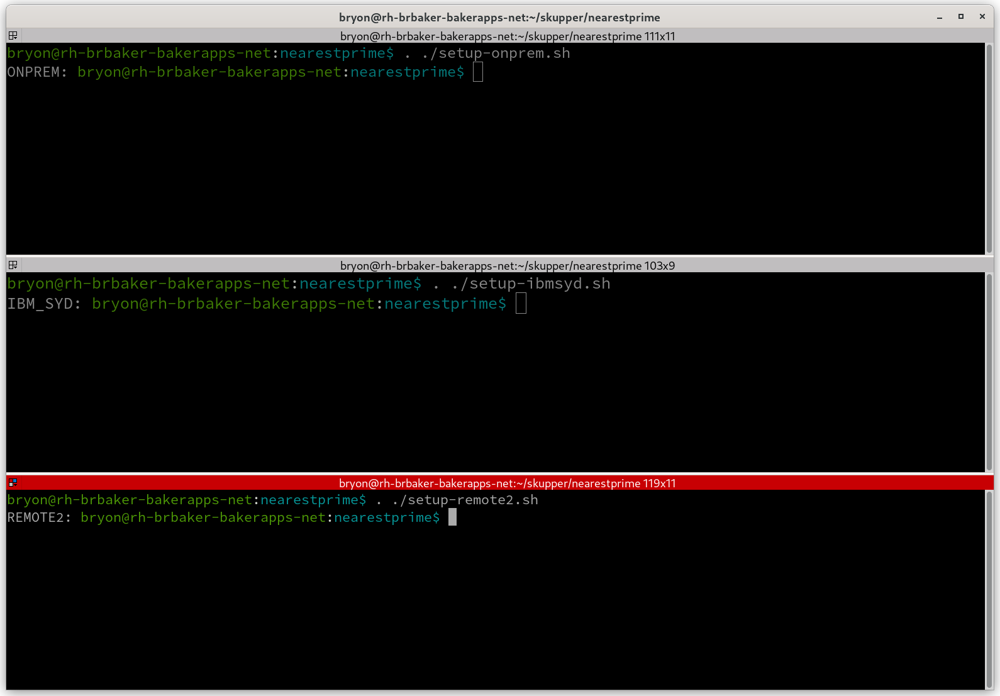

# Overview

## Demo Environment Philosophy
This demo has been structured to minimise changes to the host machine. All local apps run in podman or docker and, if desired, the python scripts run within Python's `virtualenv` and `virtualenvwrapper`. This makes it simple to remove and inherently portable.

<span style="color:yellow">REVISIT: Need to move the load generator into a container. </span>

## Overview of thie Git Repo

The high-level strucyture of the demo code is:
```
├── components
│   ├── load-gen
│   │   ├── mvnw
│   │   ├── mvnw.cmd
│   │   ├── pom.xml
│   │   ├── README.md
│   │   └── src
│   └── nearestprime
├── demo-env
│   ├── README.md
│   ├── setup-onprem.sh
│   ├── setup-remote1.sh
│   └── setup-remote2.sh
├── docs
├── tools
│   └── dbsetup
│       └── python
│           ├── dbsetup
│           ├── get-images.sh
│           ├── ocp-setup.sh
│           ├── setup-pgsql.sh
│           ├── shutdown-npdb.sh
│           └── start-np.sh
└── yaml
    ├── on-prem-nearestprime.yaml
    ├── pgadmin4-dc.yaml
    ├── remote1-nearest-prime.yaml
    └── remote2-nearest-prime.yaml

```
### Summary:
- **components:** contains the *nearestprime* application that is deployed to OpenShift, and the Quarkus-based load generator that you will run on your laptop.
- **demo-env:** contains some bash scripts to allow concurrent connectivity to multiple OpenShift clusters without the need to swictch kube contexts. 
- **docs:** contains demo documentation.
- **tools:** contains all the tools for starting/stopping/initialising the database that you will run on your laptop. The database and a database admin tool (pgadmin4) will run as a container on your laptop.
- **yaml:** contains the yaml files required to deploy to OpenShift.

## Environment Setup and Configuration
### Overview
This example has been tested running two configurations:
1. Using Fedora 36 running OpenShift Local (previsously known as Code Ready Containers) as the "on premises cluster, and the RHAI Gateway in Podman."
2. Fedora 36 running the RHAI Gateway as "on premises" and all OpenShift clusters in the public cloud. Note: The instructions are the same, just the location of all the OpenShift clusters.

In all, the demonstration uses three clusters. One "on premises," and two remote clusters. You can get away with one remote cluster and run two projects (name spaces) but be careful of the context switching.

**Note:**
- There should be no reason this does not work on macOS or other linux distributions for the "on premises environment." The setup script should detect either podman or docker.
- This example will also work with any other Kubernetes distribution such as EKS and GKE after some very minor tweaks to replace the `oc` commands with `kubectl` commands.

### Demo Prerequisites
1. In order to pull the Postgresql image you will need a Red Hat account to pull from the Red Hat Container Catalogue. You can log on to the registry using:

   ```
   podman login registry.redhat.io
   ```

2. Skupper v1.0.2 or later. Available at: https://skupper.io/install/index.html
3. OpenShift Local v4.10 - but this should work on any OpenShift 4 verison with no chganges.


### Isolating the OpenShift Environments
To run this demo you will need console access to multiple clusters. To achieve this you need separate kubeconfig files. The git repo has some example environment-setup scripts in the `demo-env` directory.

 Run these in their own terminal session **BEFORE** you log on to each cluster. Note the `period` before the script name. Without this the config will not be persisted when the script completes. E.g.

```
. ./setup-onprem.sh
```

Example:


Feel free to customise the supplied scripts to match your environment setup.


### Pull the required images
There is a bash script to pull down the images for the database: `get-images.sh` located in `./tools/dbsetup/get-images.sh`. Use this to automate pulling the images, or you can pull them manually using:

```
podman pull docker.io/dpage/pgadmin4:6.11
podman pull registry.redhat.io/rhel8/postgresql-13:1-56.1654147925
```

Return to [Main Index](../README.md)
